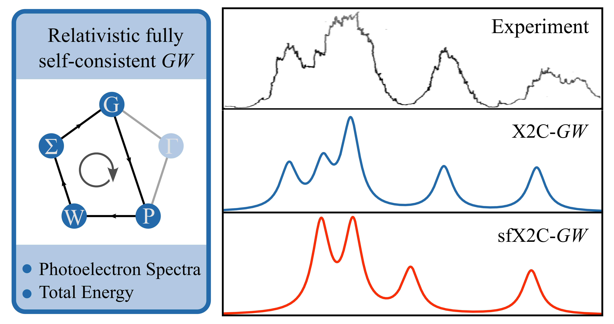

---

##### Links

+ [Paper](https://pubs.acs.org/doi/abs/10.1021/acs.jctc.4c00075)
+ [Code](https://green-phys.org/)

---

##### Abstract

This study effectively presents a comprehensive analysis on the fully self-consistent GW method, highlighting its advantages in accurately predicting ionization potentials and photoelectron spectra for heavy element-containing molecules, while also addressing its computational efficiency and reliability through extensive benchmarking.

---

---

