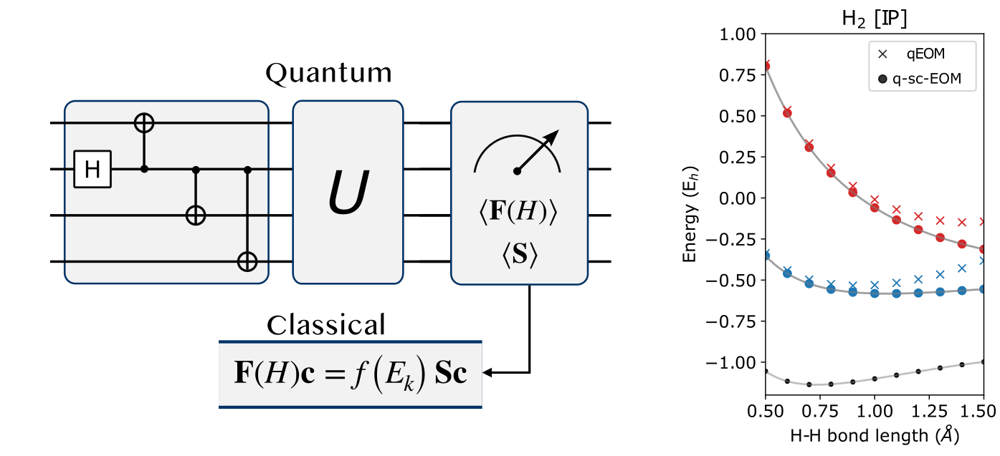

---

##### Links

+ [Paper](https://pubs.rsc.org/en/content/articlehtml/2023/sc/d2sc05371c)

---

##### Abstract
This work introduces the equation-of-motion-based method (q-sc-EOM) for calculating excitation energies on near-term quantum computers, addressing the need for reliable excited-state simulations. The method leverages self-consistent operators to ensure accuracy while satisfying the vacuum annihilation condition. Numerical simulations on small molec    ules demonstrate that q-sc-EOM provides precise energy differences for vertical excitations, ionization potentials, and electron affinities. Additionally, its design enhances resilience to noise, making it well-suited for implementation on Noisy Intermediate-Scale Quantum (NISQ) devices, thereby facilitating routine excited-state calculations essential for c    hemical and material research.

---

---

