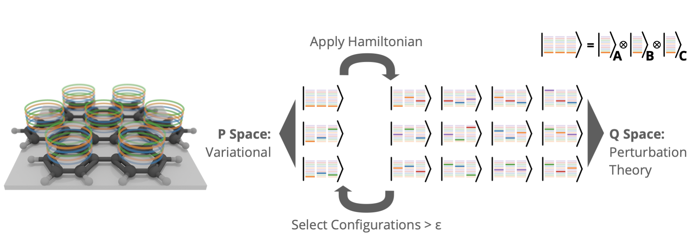

---

##### Links

+ [Paper](https://pubs.acs.org/doi/abs/10.1021/acs.jctc.0c00141)

---

##### Abstract
The paper presents tensor product selected configuration interaction (TPSCI), a novel method that enhances selected configuration interaction (SCI) by utilizing local molecular structures to reduce the number of SCI variables. By grouping orbitals into clusters and employing many-particle cluster states instead of Slater determinants, TPSCI achieve    s significant computational efficiency and accuracy. The method is particularly effective when cluster states are defined using Tucker decomposition of the SCI vector.

---

---

