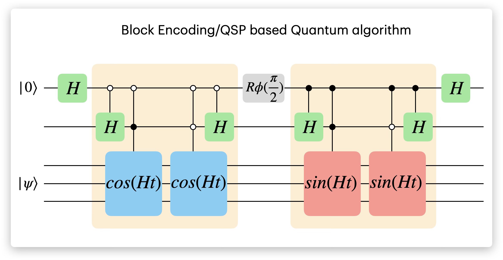

---

##### Links

+ [Paper](https://pubs.aip.org/aip/jcp/article/164/10/104113/3383265/Elucidating-many-body-effects-in-molecular-core)
+ [Preprint (arXiv:2511.17985)](https://arxiv.org/abs/2511.17985)

---

---
